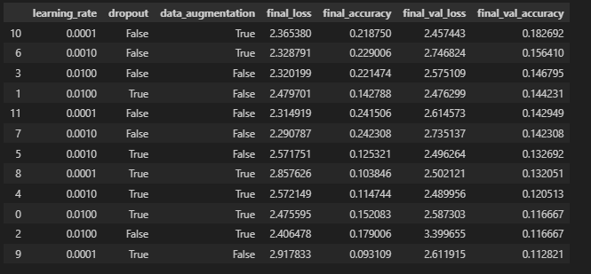
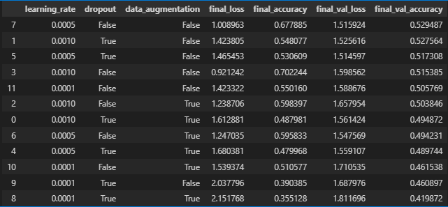

# Classification de Mouvements Artistiques

Projet réalisé dans le cadre du module 5202C à l'ESIEE Paris (E5 - dernière année du cursus ingénieur).

L'objectif est de classifier des oeuvres d'art selon leur mouvement artistique en comparant trois architectures de réseaux de neurones : un réseau Fully Connected (FC), un réseau convolutif (CNN) et un modèle pré-entraîné via Transfer Learning (MobileNetV2).

## Structure du projet

```
.
├── rapport.ipynb        # Notebook principal : exploration, entraînement et évaluation
├── artlib.py            # Bibliothèque utilitaire (modèles, visualisations, entraînement)
├── image/               # Résultats des entraînements (tableaux de performances)
│   ├── resultat_FC.png
│   └── resultat_TL.png
└── dataset_600/         # Dataset (non versionné) - 600 images par classe
```

## Dataset

Le dataset a été constitué manuellement sur environ 2 semaines (~15 heures de recherche). Il contient **7 800 images** réparties en **13 mouvements artistiques** :

| Mouvement | Mouvement | Mouvement |
|---|---|---|
| Academic Art | Art Nouveau | Baroque |
| Expressionnisme | Art Japonais | Néoclassicisme |
| Primitivisme | Réalisme | Renaissance |
| Rococo | Romantisme | Symbolisme |
| Art Médiéval Occidental | | |

Chaque classe contient **600 images**. Le dataset est divisé en 80/20 (6 240 entraînement / 1 560 validation).

## Architectures

### 1. Fully Connected (FC)

Réseau dense simple avec trois couches cachées (256 -> 128 -> 64 neurones), option dropout. Les images sont aplaties en entrée (224x224).

### 2. CNN

Architecture convolutive avec couches denses, option dropout. Images redimensionnées en 128x128.

### 3. Transfer Learning - MobileNetV2

Utilisation du modèle MobileNetV2 pré-entraîné sur ImageNet. Les couches du modèle de base sont gelées et seules les couches de classification ajoutées sont entraînées (fine-tuning).

## Résultats

Chaque architecture a été entraînée sur plusieurs combinaisons d'hyperparamètres (learning rate, dropout, data augmentation) afin de sélectionner le meilleur modèle.

| Architecture | Meilleure Accuracy (validation) | Learning Rate |
|---|---|---|
| Fully Connected | **22.56%** | 0.01 |
| CNN | **23.46%** | 0.01 |
| Transfer Learning (MobileNetV2) | **54.62%** | 0.001 |

Le Transfer Learning surpasse largement les deux autres approches, démontrant l'intérêt des modèles pré-entraînés pour la classification d'images, en particulier sur des datasets de taille modeste.

### Tableaux de résultats

**Fully Connected :**



**Transfer Learning :**



## Bibliothèque utilitaire - artlib.py

`artlib.py` centralise l'ensemble des fonctions utilisées dans le notebook :

- **Construction des modèles** : `build_fc_model()`, `build_cnn_model()`, `build_mobilenetv2()`
- **Entraînement** : `train_model()`, `train_all_models()` avec recherche d'hyperparamètres
- **Visualisation** : courbes d'entraînement, matrice de confusion, rapports de classification, précision et rappel par classe
- **Données** : chargement, augmentation, affichage d'échantillons

## Technologies

- Python
- TensorFlow / Keras
- NumPy, Matplotlib, Seaborn
- scikit-learn

## Utilisation

1. Placer le dataset dans un dossier `dataset_600/` à la racine du projet (600 images par classe)
2. Ouvrir `rapport.ipynb` dans Jupyter Notebook
3. Exécuter les cellules séquentiellement

## Auteur

Projet réalisé à l'ESIEE Paris - E5 (2024-2025)
